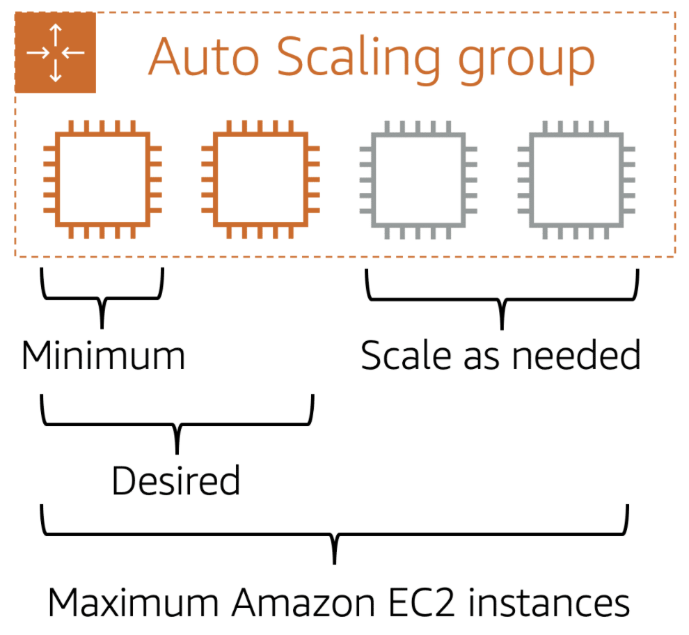
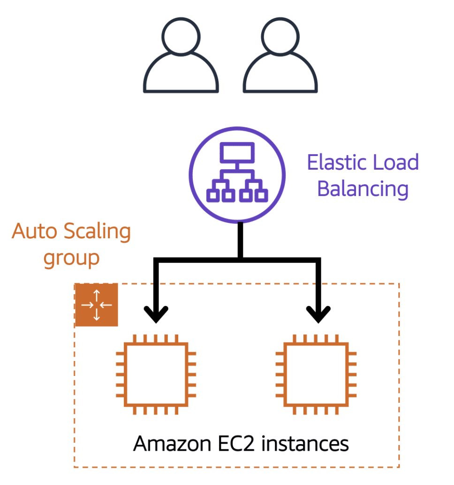
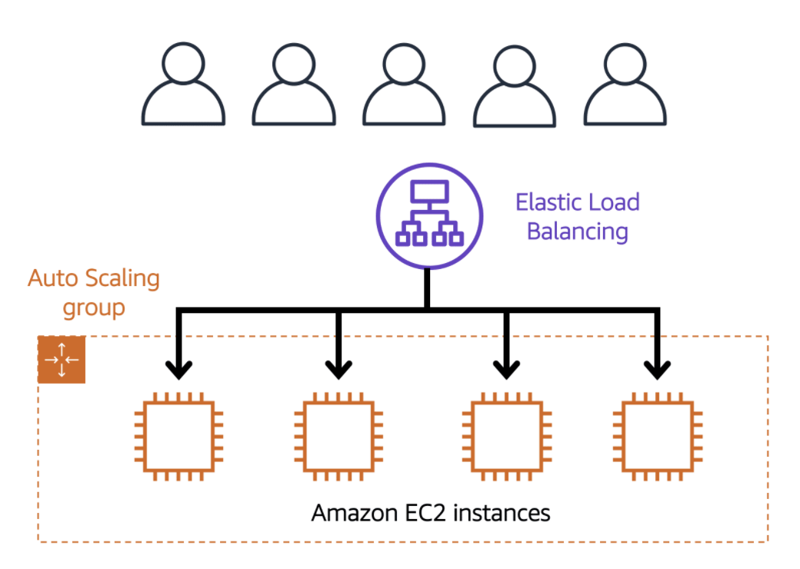
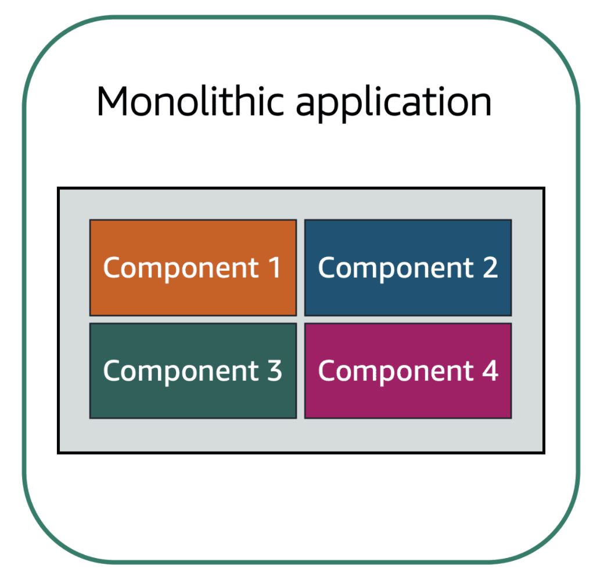
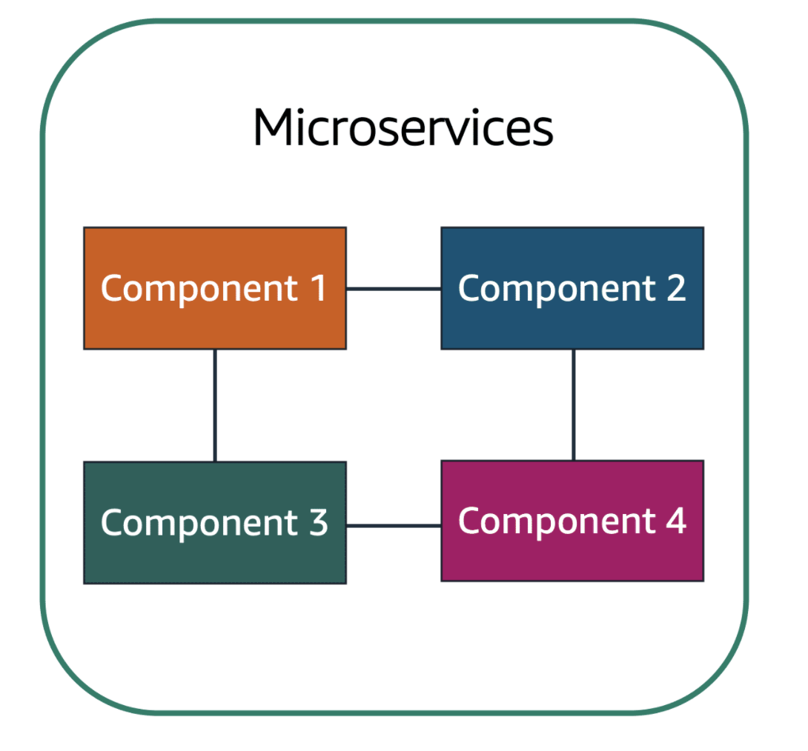

# AWSCloudPracticionerCourse

This Repository will have all the notes and pertinent code in order to fully understand and achieve the AWS Certified Cloud Practitioner Basics. This repository was originally developed by [Fabián Camp](https://fabshub.net). It is highly recommended to have your personal account in AWS in order to fully understand the course and to take the course directly from AWS training.

## Table of Contents

1. [ Module 1: Introduction to Amazon Web Services ](#module-1)
    1. [ Client-server model ](#client-server-model)
    2. [ Cloud computing ](#cloud-computing)
        1. [ Deployment models for cloud computing ](#cloud-computing-models)
            1. [ Cloud based deployment ](#cloud-based)
            2. [ On-premises deployment ](#on-premises)
            3. [ Hybrid deployment ](#hybrid)
        2. [ Benefits of cloud computing ](#cloud-computing-benefits)
2. [ Module 2: Compute in the Cloud ](#module-2)
    1. [ Amazon Elastic Compute Cloud (Amazon EC2) ](#ec2-summary)
        1. [ Amazon EC2 instance types ](#ec2-types)
        2. [ Amazon EC2 pricing ](#ec2-pricing)
            1. [ On-Demand ](#ec2-pricing-on-demand)
            2. [ Amazon EC2 Saving Plans ](#ec2-pricing-saving-plans)
            3. [ Reserved Instances ](#ec2-pricing-reserved-instances)
            4. [ Spot Instances ](#ec2-pricing-spot-instances)
            5. [ Dedicated Hosts ](#ec2-pricing-dedicated-hosts)
        3. [ Scaling Amazon EC2 ](#ec2-scaling)
            1. [ Amazon EC2 Auto Scaling ](#ec2-auto-scaling)
    2. [ Directing trafic with Elastic Load Balancing ](#directing-trafic)
        1. [ Elastic Load Balancing (ELB) ](#elastic-load-balancing)
    3. [ Messaging and queuing ](#messaging-queuing)
        1. [ Monolithic applications and microservices ](#monolithic-and-microservices)
            1. [ Monolithic applications ](#monolithic)
            2. [ Microservice applications ](#microservice)
        2. [ Amazon Simple Queue Service ](#amazon-sqs)
        3. [ Amazon Simple Notification Service ](#amazon-sns)
    4. [ Additional compute services ](#compute-services)
        1. [ Serverless ](#serverless)
        2. [ AWS Lambda ](#aws-lambda)
        3. [ AWS Elastic Container Service (ECS) and AWS Elastic Kubernetes Service (EKS) ](#aws-ecs-eks)
            1. [ AWS Elastic Container Service ](#aws-ecs)
            2. [ AWS Elastic Kubernetes Service (EKS) ](#aws-eks)
        4. [ AWS Fargate ](#aws-fargate)
3. [ Module 3: Global Infrastructure and Reliability ](#module-3)

## Module 1: Introduction to Amazon Web Services

### 1.1 Client-server model

A **client** can be a web browser or desktop application that a person interacts with to make requests to computer servers. In the other hand, a **server** can be services such as Amazon Elastic Compute Cloud (Amazon EC2) that is a type of virtual server.

An example of this is the following, you make a request for a particular photo that you are interested in then, the server will evaluate the details of that request, if that evaluation fulfills the server needs then it will return the photo you ask for.

### 1.2 Cloud computing

When we talk about cloud computing first it is important to understand what is cloud computing for AWS, this is:

> **Cloud computing** is the on-demand delivery of IT resources over the internet with pay-as-you-go pricing.

**On-demand delivery** on AWS indicates that AWS has the resources you need, when you need them. If you suddenly need 300 virtual servers only a few click and you got them, this also applies for storage. You don't need to tell AWS in advance that you're going to need that resources. This kind of flexibility is just not possible when you're managing your own data centers.

Another important definition to have in mind is what AWS call the **undifferentiated heavy lifting of IT**. This is, tasks that are common, often repetitive and ultimately time-consuming; these are the tasks AWS wants to help you with. So you can focus on what makes you unique.

Finally, with **pay-as-you-go pricing**, AWS points out an example of a coffee shop. You don't staff a shop with employees 24 hours a day at the same levels you do during peak hours. In fact, some hours, you might not even staff them at all.

#### 1.2.1 Deployment models for cloud computing

When selecting a cloud strategy, a company must consider factors such as required cloud application components, preferred resource management tools, and any legacy IT infrastructure requirements.

There are three cloud computing deployment models are cloud-based, on-premises, and hybrid.

##### 1.2.1.1 Cloud-based deployment

- Run all parts of the application in the cloud.
- Migrate existing applications to the cloud.
- Design and build new applications in the cloud.

In this model you can migrate existing applications to the cloud, or you can design and build them in the cloud. You can build those applications on low-level infrastructure or on a high-level services that reduce the management, architecting, and scaling requirements of the core infrastructure. In other words, you don't need to think in your infrastructure because all the deployment is completely in the cloud.

##### 1.2.1.2 On-premises deployment (Private Cloud)

- Deploy resources by using virtualization and resource management tools.
- Increase resource utilization by using application management and virtualization and resource management tools.

It is also known as _private cloud_ deployment. In this model, resources are deployment on premises by using virtualization and resource management tools.

This model its useful when you have an infrastructure that is located on your data center. AWS has tools that allows you to deploy cloud services on your infrastructure, this is called on-premise.

##### 1.2.1.3 Hybrid deployment

- Connect cloud-based resources to on-premises infrastructure.
- Integrate cloud-based resources with legacy IT applications.

In Hybrid deployment, cloud-based resources are connected to on-premises infrastructure. You might want to use this approach in a number of situations. For example, you have legacy applications that are better maintained on premises, or government regulations require your business to keep certain records on premises.

In other words, this kind of deployment is used when you have strict regulations (like government stuff). So an example of this let's say we have the Red Hat servers on-premise (in our infrastructure) but we are using DynamoDB (AWS cloud service for database) we can connect our infrastructure with DynamoDB. This example is what AWS call Hybrid deployment.

#### 1.2.2 Benefits of cloud computing

Some of the benefits we can find when we talk about cloud computing are the following ones:

Benefit | Description
------- | -----------
Trade upfront expense for variable expense | **Upfront expense** refers to data centers, physical servers, and other resources that you would need to invest **variable expense** refers to the cloud computing approach, implement innovative solutions while saving on costs.
Stop spending money to run and maintain data centers | A benefit of the cloud computing is the ability to focus less on these tasks and more on your applications and customers.
Stop guessing capacity | With cloud computing, you don’t have to predict how much infrastructure capacity you will need before deploying an application.
Benefit from massive economies of scale | By using cloud computing, you can achieve a lower variable cost than you can get on your own.
Increase speed and agility | The flexibility of cloud computing makes it easier for you to develop and deploy applications.
Go global in minutes | AWS Cloud enables you to deploy applications to customers around the world quickly, while providing them with low latency.

## Module 2: Compute in the cloud

### 2.1 Amazon Elastic Compute Cloud (Amazon EC2)

Provides secure, resizable compute capacity in the cloud as Amazon EC2 instances. EC2 runs in the top of physical host machines managed by AWS using virtualization technology. When you use an EC2 instance you're not necessarily talking to the entire host to yourself. Instead, you are sharing this host with multiple other instances known as **virtual machines**. A **hypervisor** is responsible for sharing underlying physical resources between the virtual machines. This idea of sharing the underlying hardware is called **multitenancy**; in other words, the _hypervisor_ is responsible for coordinating this _multitenancy_ and this is managed by AWS. Also, the _hypervisor_ is responsible for isolating the virtual machines from each other as they share resources from the host this means, that the EC2 instances are secure.

Amazon EC2 allows you to choose the operating system (Windows or Linux), you can also configure what software you want running on the instance. Whether it's your own internal business applications, simple web apps, or complex web apps, databases or third party software like enterprise software packages, you have complete control over what happens on that instance.

It is important to mention what AWS call **vertically escalation**, this is that you may start with a small instance but latter on you see that the applications running in that instance is starting to max out the server so you can give that instance more memory and more CPU.

In order to use an Amazon EC2 instance there are only 3 steps:
1. Launch an instance.
2. Connect to that instance (there are multiple ways to connect to them).
3. Use the instance.

> Note: With Amazon EC2 instances you only pay for what you use. This means, you only pay for running instances, not stopped or terminated instances.

#### 2.1.1 Amazon EC2 instance types

Amazon EC2 gives us, depending on our needs, different types of EC2 instances that we can use:

General Purpose instance | Compute Optimized instance | Memory Optimized instance | Accelerated Computing instance | Storage Optimized instance |
------------------------ | -------------------------- | ------------------------- | ------------------------------ | -------------------------- |
Provide a balance of compute, memory, and networking resources | Are ideal for compute-bound applications that benefit from high-performance processors | Are design to deliver fast performance for workloads that process large datasets in memory | Use hardware accelerators, or coprocessors, to perform more efficiently than is possible in software running on CPU's | Are designed for workloads that require high, sequential read and write access to large datasets on local storage.
Can be used for a variety of diverse workloads like web service or code repositories | Ideal for compute-intensive tasks like gaming servers, high performance computing or HPC, and even scientific modeling | Are good for memory-intensive tasks | Are good for floating point number calculations, graphic processing, or data pattern matching | Are good for workloads that require high performance for locally stored data

#### 2.1.2 Amazon EC2 pricing

The are different type of pricing for the EC2 instances depending on the usage and your needs. We will going to explore the different kind of pricing that AWS offers to you.

##### 2.1.2.1 On-Demand

- You only pay for the duration that your instance  runs for.
- Are ideal for short-term, irregular workloads that cannot be interrupted.

##### 2.1.2.2 Amazon EC2 Saving Plans

- Offers low prices on EC2 usage in exchange for a commitment to a consistent amount of usage measured in dollars per hour for a one or three-year term.
- Provide savings up to 72% on your AWS compute usage.

##### 2.1.2.3 Reserved Instances

- Are suited for steady-state workloads or ones with predictable usage.
- Provide savings up to 75%  discount verses On-Demand pricing, you qualify for a discount once you commit to a one or three-year term.
- There are 3 different payment types, **All upfront**, where you pay for them in full when you commit; **partial upfront**, you pay a portion when you commit; and **no upfront**, you don't pay anything at the beginning.

##### 2.1.2.4 Spot Instances

- They allow you to request spare Amazon EC2 computing capacity for up to 90% off the On-Demand price.
- AWS can reclaim the instance at any time they needed, giving you a two minute warning to finish up work and save state.

##### 2.1.2.5 Dedicared Hosts

- Are physical hosts dedicated for your use for EC2.
- There are usually for meeting certain compliance requirements and nobody else will share tenancy for that host.
- Dedicated Hosts are the most expensive of all the pricing options.

#### 2.1.3 Scaling Amazon EC2

Scalability involves beginning with only the resources you need and designing your architecture to automatically respond to changing demand by **scaling out or in**. As a result, you only pay for the resources you use, also this process can happen automatically if you need to. AWS provides an **Auto Scaling** functionality for Amazon EC2 instances.

**Scaling up (in)** means adding more power to the machines that are running while while **scaling out** means adding more instances in order to get the job done.

##### 2.1.3.1 Amazon EC2 Auto Scaling

This feature enables you to automatically _add_ or _remove_ Amazon EC2 instances in response to changing application demand. By automatically scaling your instances in and out as needed, you are able to maintain a greater sense of application availability. It exists two different approaches that you can follow:

Dynamic Scaling | Predictive Scaling
--------------- | ------------------
Response to changing demands | Automatically schedules the right number of Amazon EC2 instances based on predicted demand.

> Note: to scale up faster, you can use dynamic scaling and predictive scaling toguether.

When you create an Auto Scaling group, you can set the minimum number of Amazon EC2 instances, the desired capacity and the maximum capacity. The minimum capacity is the number of Amazon EC2 instances that launch immediately after you have created the Auto Scaling group, the desired capacity as the name explains is the desired capacity that you want your EC2 instance to have (if is not specified the default number will be the minimum capacity). Last but not least, the maximum capacity tells AWS in how many instances you can scale out in response to increased demand.

> Note 2: Because Amazon EC2 Auto Scaling uses Amazon EC2 instances, you pay for only the instances you use, when you use them.

### 2.2 Directing trafic with Elastic Load Balancing

A **load balancer** is an application that takes in requests and routes them to the instances to be processed. AWS gives us the chance to decide between using whatever we want to use to balance the trafic, can be the load balancer that you already are using or you can use the Amazon service **Elastic Load Balancing (ELB)**

#### 2.2.1 Elastic Load Balancing (ELB)

Is one of the first major managed services, it's engineered to address the undifferentiated heavy lifting of load balancing. ELB is automatically scalable. Also, ELB is not only used for external trafic you can also use it for internal trafic allowing multiple front-ends to communicate with the available back-ends.

So, in other words, **Elastic Load Balancing** is the AWS service that automatically distributes incoming application traffic across multiple resources, such as Amazon EC2 instances. A load balancer acts as a single point of contact for all incoming web traffic to your Auto Scaling Group. This means that as you add or remove Amazon EC2 instances the process that it will follows is the next one:

1. The requests route the Load Balancer first.
2. Then the requests spread across the multiple resources that will handle them.

A graphic example will be the following ones:

- Elastic Load Balancing - Low Demand requests:

- Elastic Load Balancing - High Demand requests:

### 2.3 Messaging and queuing

The messaging and queuing idea born from the problem that exists in a **tightly coupled architecture**, in this type of architecture if one of the parts fail it will cause that the other part also fails, for example, component a is communicating with component b. Suddenly, component b stops working so the messages that are being sent by a are not being delivered in consequence, component a fails.

To solve this problem we put some sort of buffer that is called messaging and queuing. For this, AWS offers to us two services:  **Amazon Simple Queue Service (Amazon SQS)** and **Amazon Simple Notification Service (Amazon SNS)**.

#### 2.3.1 Monolithic applications and microservices

When we talk about architecture of applications we can think in monolithic approach or the microservices approach. So let's define what is a Monolithic application and what is a Microservice application.

Applications are made of multiple components. These components communicates with each other to transmit data, fulfill requests, and keep the application running

##### 2.3.1.1 Monolithic applications

Suppose that you have an application with tightly coupled components. These components might include databases, servers, the user interface, business logic, and so on. This type of architecture can be considered a monolithic application. In this architecture approach, if a single component fails, other component fails, and possibly the entire application fails.

##### 2.3.1.2 Microservice applications

In a microservices approach, application components are loosely coupled. In this case, if a single component fails, the other components continue to work because they are communicating with each other. When designing applications on AWS, you can take a microservices approach with services and components that fulfill different functions.

#### 2.3.2 Amazon Simple Queue Service (Amazon SQS)

Is a message queuing service. you can send, store, and receive messages between software components, without losing messages or requiring other services to be available. In Amazon SQS, an application sends messages into a queue. A user or service retrieves a message from the queue, processes it, and then deletes it from the queue.

#### 2.3.3 Amazon Simple Notification Service (Amazon SNS)

Is a publish/subscribe service. Using Amazon SNS topics, a publisher publishes messages to subscribers. In Amazon SNS subscribers can be web servers, email addresses, AWS Lambda functions, or several other options.

### 2.4 Additional compute services

AWS offers to us another way you can have your applications or projects running. EC2 instances needs someone to update and manage the instance in the other hand, AWS also offers to us services that are serverless. **Serverless** means that you cannot actually see or access the underlying infrastructure or instances that are hosting your application. Instead, all the managing of the underlying environment from a provisioning, scaling, high availability, and maintenance perspective are taken care of.

#### 2.4.1 Serverless

The term _serverless_ means that your code runs on servers, but you don't need to provision these servers. With this type of computing you can focus more on innovating new products and features instead of maintaining servers. Another benefit is the flexibility to scale serverless applications automatically.

#### 2.4.2 AWS Lambda

Is one of the serverless options that AWS offers to us. This services allows us to upload our code into a Lambda function. Configure a trigger and from there, the service waits for that trigger. When the trigger is detected, the code is automatically run in a managed environment. Lambda will scale your function to meet the demand and is designed to run code under 15 minutes, so it's not for long running processes like deep learning. It's more suited for quick processing like a web backend, handling requests or a backend expense report processing where each invocation takes **less than 15 minutes to complete**.

> Note: you only pay for the compute time that you consume. Charges apply only when your code is running.

In a little more detail, AWS Lambda works in this way:

1. Upload your code to Lambda.
2. Set code to trigger from an event source, such as AWS services, mobile applications, or HTTP endpoints.
3. Lambda (your code) runs only when triggered.
4. Pay only for the compute time you use.

#### 2.4.3 AWS Elastic Container Service (ECS) and AWS Elastic Kubernetes Service (EKS)

Both of this services offers you the capability to access the underlying environment, but with efficiency and portability. This two services are container orchestrators tools like Docker. A **container** is package for your code where you package up your application, its dependencies and configurations that are needed to run. These containers run on top of EC2 instances and run in isolation from each other similar to how virtual machines work. In other words, a _container_ is packaging your applications code and dependencies into a single object. Nevertheless, you can also use containers for processes and workflows in which there are essential requirements for security, reliability, and scalability.

When you use Docker containers running across not just one EC2 instance, but a number of them together (called a **cluster**). The process of doing this tasks is called **container orchestration** and it's really hard to do on your own, ECS is designed to help you run your containerized applications at scale without the hassle of managing your own container orchestrator software. EKS does a similar thing, but uses different tooling and with different features.

##### 2.4.3.1 AWS Elastic Container Service (ECS)

Is a software platform that enables you to build, test, and deploy applications quickly. Supports the use of open-source Docker Community Edition and subscription Docker. With this service, you can use API calls to launch and stop Docker-enabled applications.

##### 2.4.3.2 AWS Elastic Kubernetes Service

Is a open-source software that enables you to deploy and manage containerized applications at scale.

#### 2.4.4 AWS Fargate

Is a serverless compute platform for ECS or ECK. This service is the alternative when you don't want to think about using the EC2 instances, you don't need access to the underlying OS or you don't want to manage those EC2 instances. With this service you don't need to provision or manage servers, AWS Fargate manages your server infrastructure for you.

## Module 3: Global Infrastructure and Reliability

